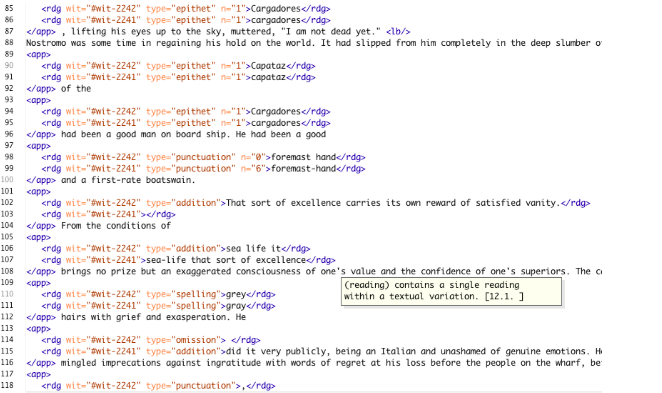
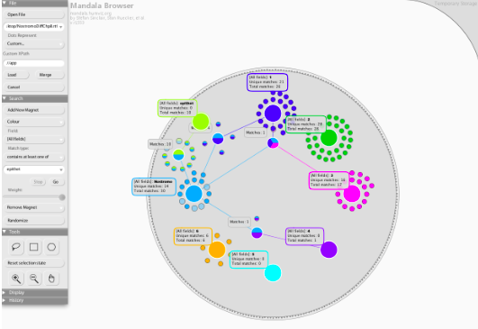
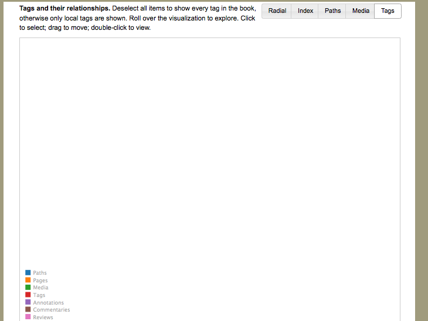
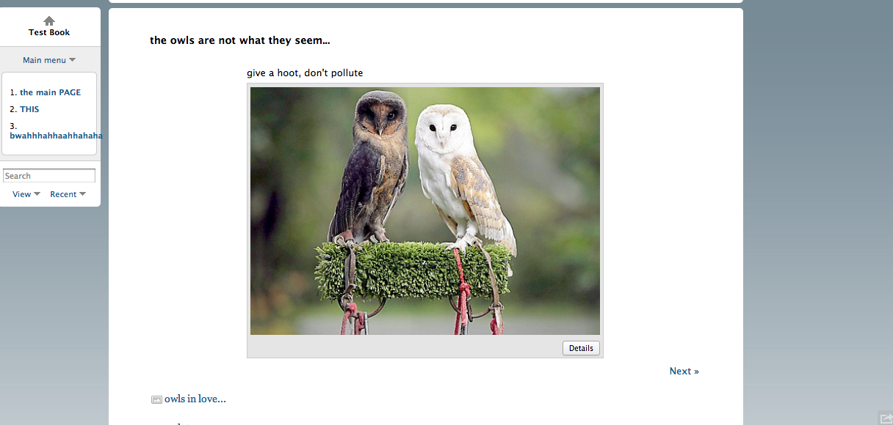
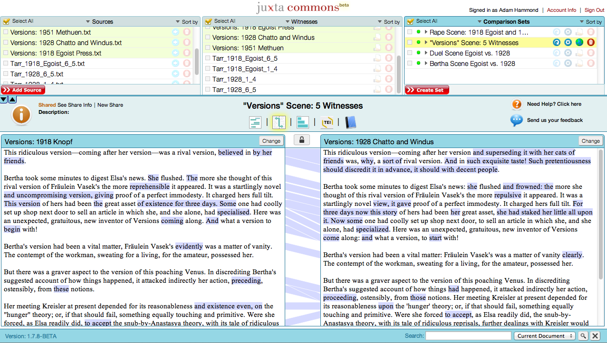
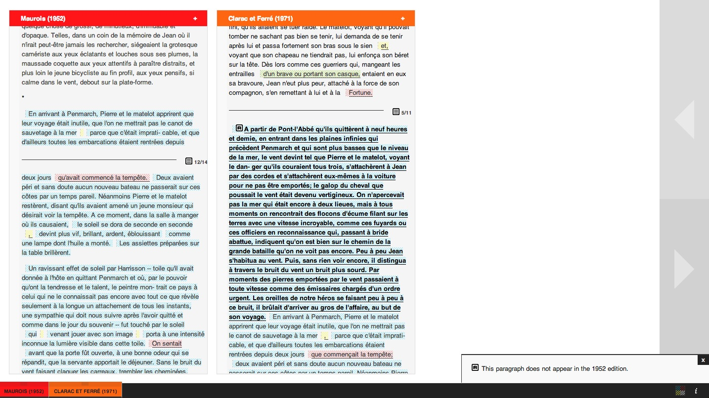

# Lab Meeting: 21 March 2013

Regrets: Stephen, Shaun, Arthur, Matt 

# Announcements 

* HASTAC Presentations in April: Adam, Adèle, Alex, Katie, Nina, Shaun, and Jentery
* Research for a Better Life: We won! (Congrats, team of eight!) 
* Lab to edit a special issue of NANO
* Long Now of Ulysses Exhibit to launch May 17th

# Presentations

## Katie 

Question: How to make the visualizations meaningful to readers / audiences, especially when we are scaling cultural formations? 

## Jana 

 

Question: How to use tags meaningfully in the online exhibit? Are they meaningful? And how linear should the exhibit be? 

## Mikka 

Smile! Check out Scalar. Make a book. 

## Adam 

Question: Is what I'm finding/seeing/discovering a product of bias/perspectives? 

## Amanda

Question: 

## Adèle

Question: 

## Alex

 

Question:

